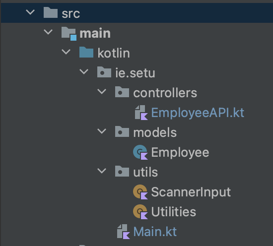
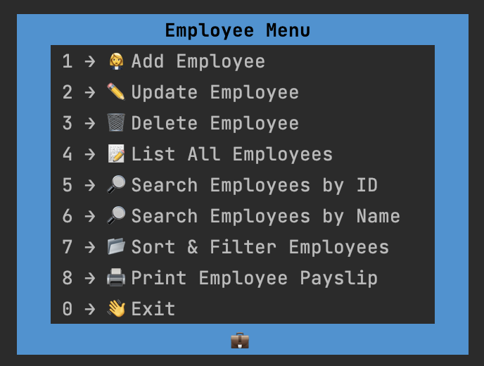
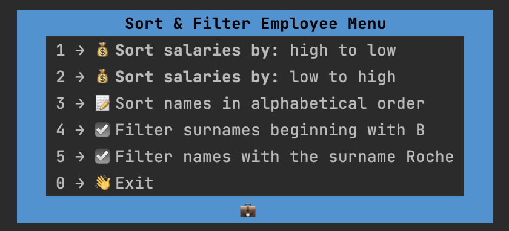
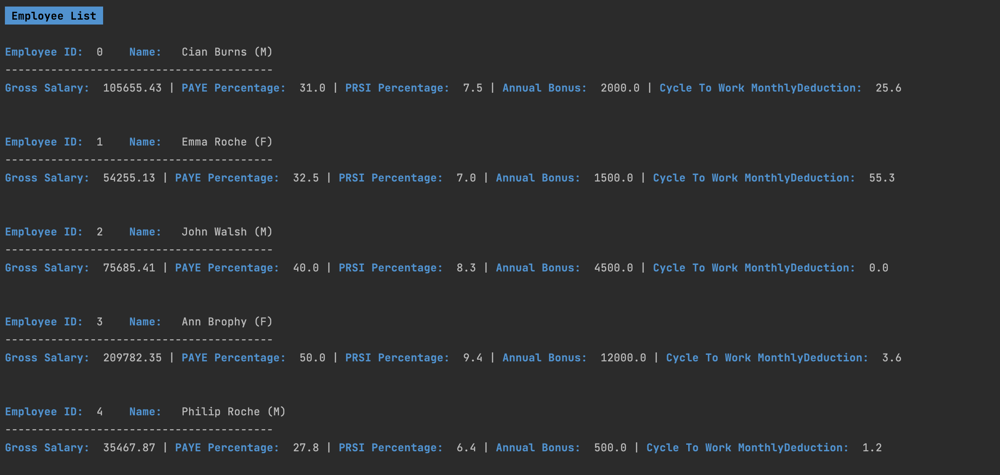
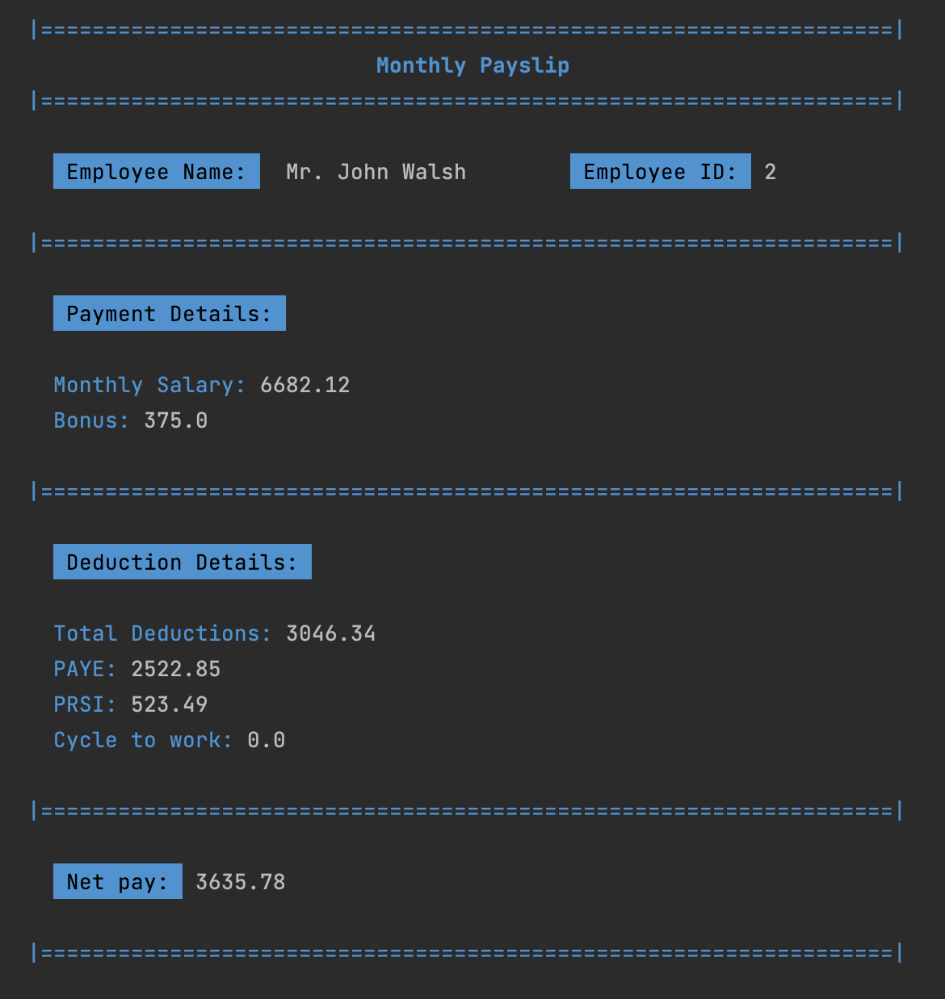

# Employee-App
Assignment 1 for Software Development Tools
## App Description
This is a console Employee App written in Kotlin. 

During the past 4 weeks I completed the first 3 labs 
in my Software Development Tools module, where I added
functionality to the employee-app such as, adding a new employee,
listing all employees, searching for an employee by ID and printing employee payslips.

For Assignment 1, we were given the task to add extra functionality
(that was not specified in the labs) to the employee app. 
I added 8 new functionalities to the employee app. 
I added functionality to delete an employee, update an employee,
search for employees by first name and 
multiple different sorting and filtering
functionalities that are listed in the App Functionality section below.

I included and used gradle/kotlin logging throughout my app and I followed 
this package structure:

## App Functionality

There is an Employee Menu that allows the user to select from multiple different functionality options such as:
* Adding a new employee
* Listing all employees
* Searching for an employee by ID
* Printing employee payslips
* Updating an employee
* Deleting an employee
* Searching for an employee by first name 

The Employee Menu includes a sub menu called the 
Sorting and Filtering Menu that includes functionality options such as:
* Sorting employees by salary (highest to lowest)
* Sorting employees by salary (lowest to highest)
* Sorting employees in alphabetical order of their first name
* Filtering and finding employees with surnames that begin with 'B'
* Filtering and finding employees with the surname 'Roche' 

## User Interface

In the labs there was a very basic UI layout applied. 
For the assignment I improved the UI of the employee-app. I used the same blue colour 
throughout my app to keep it clean, consistent and easy to follow along with. 
I also added related emojis beside the options in the Menu's to add a little fun!

Here are some screenshots of the updated UI:

Employee Menu:

Sorting & Filtering Employee Menu:

Employee List:

Payslip:

## References
As I am only getting familiar with using Kotlin
I needed to find resources, outside of class materials, 
to guide me in finding functions that I could use
in order to get the functionalities, I wanted to newly add, to work and 
to use these resources to gain an understanding how these functions work. 

I did some online research and found the following 
resources that I incorporated into my app 
and adjusted/troubleshooted accordingly to fit my app's data and layout:

* To help me improve the UX/UI of my employee app by adding colour I used: https://www.lihaoyi.com/post/BuildyourownCommandLinewithANSIescapecodes.html
* To help me with the update and delete employee functions in the Main.kt I used: https://github.com/sdrohan/notes-app/blob/master/src/main/kotlin/Main.kt
* To help me with the update and delete employee functions in the controllers/EmployeeAPI.kt I used: https://github.com/sdrohan/notes-app/blob/master/src/main/kotlin/controllers/NoteAPI.kt
* To make the update and delete employee functions work, I added a function in utils/ScannerInput.kt and I used the code from the week 4 notes-app lab: https://reader.tutors.dev/#/lab/sdt-sept-2022.netlify.app/topic-04-kotlin-and-junit/unit-02-labs/book-01-notes-app-v1/05
* To make the update and delete employee functions work, I also added a function in utils/Utilities.kt and I used the code from: https://github.com/sdrohan/notes-app/blob/master/src/main/kotlin/utils/Utilities.kt
* To help me with the sorting and filtering functionalities I used: https://reader.tutors.dev/#/lab/sdt-sept-2022.netlify.app/topic-03-kotlin-and-gradle/unit-02-labs/book-01-classes-and-collections/05
  & https://www.codevscolor.com/kotlin-5-ways-sort-list-ascending-descending 

Throughout my code I also referenced these links in comments over the related functions.